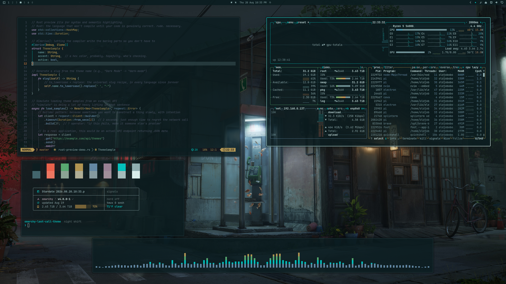
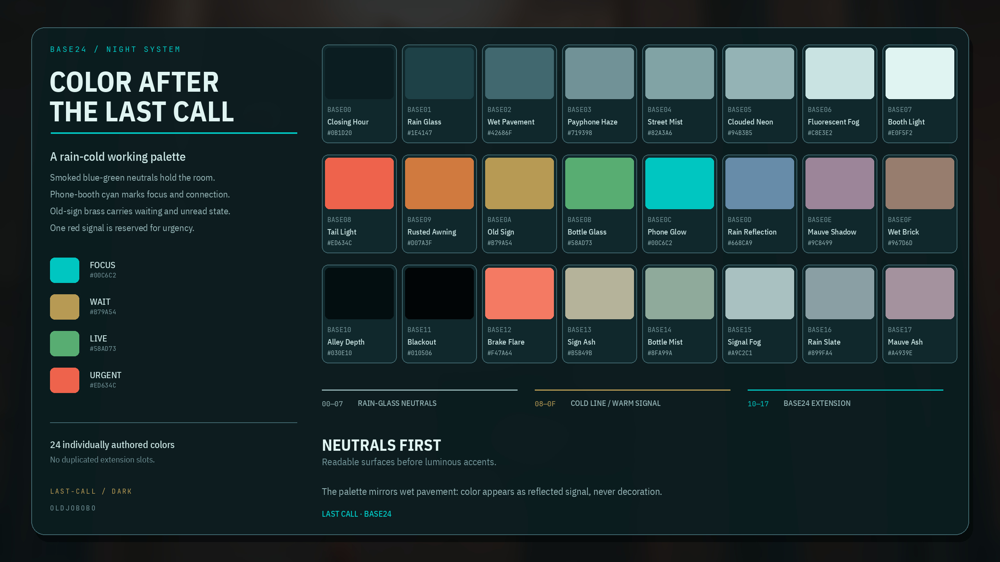
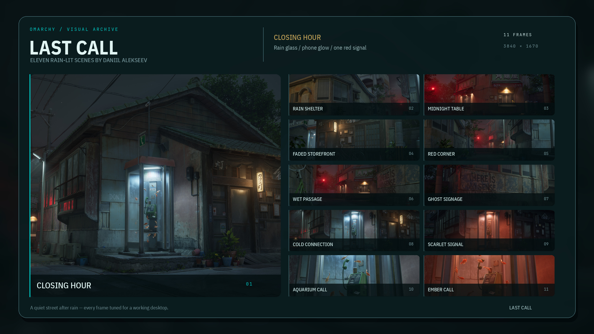

# Omarchy Last Call Theme

A rain-lit, late-night Omarchy theme inspired by Daniil Alekseev’s *Last Call*. Smoked blue-green surfaces keep the desktop calm; fluorescent cyan, vivid brass, living green, and a single red signal make every important state easy to read.

## Preview



## Install

Install directly with Omarchy:

```bash
omarchy-theme-install https://github.com/OldJobobo/omarchy-last-call-theme
```

Select **Last Call** from the Omarchy theme menu after installation.

## The Experience

- **A quiet working canvas** — deep rain-glass backgrounds reduce glare without crushing detail.
- **Signals with meaning** — cyan marks focus, yellow marks waiting and unread activity, green confirms positive state, and red is reserved for urgency.
- **Minimal geometry** — narrow borders and restrained rounding keep the desktop precise rather than soft or bubbly.
- **Wallpaper-aware depth** — translucent terminals, focused blur, and dark shadows preserve the street scene without sacrificing text clarity.
- **One visual language** — the shell, terminals, editors, system tools, and Discord all follow the same palette and state hierarchy.

## What’s Included

- Omarchy 4 shell styling and native Hyprland presentation
- Alacritty, Foot, Ghostty, and Kitty themes
- Zed, VS Code, and Neovim/Aether editor treatments
- btop, GTK, Chromium, and Zellij integration
- A custom Midnight-based Vencord theme
- A complete 24-color Base24 scheme
- Eleven coordinated wallpapers

## Vencord

Discord receives a full Last Call treatment rather than a simple palette swap:

- smoked-glass panels and a separated message composer
- a custom payphone home icon
- compact `4px` rounding that visually matches the desktop
- vivid yellow unread channels and markers
- cyan focus, selection, links, and active borders
- red mention and urgent-state signaling
- coordinated presence colors, code blocks, scrollbars, and muted text

Load [`vencord.theme.css`](vencord.theme.css) through Vencord’s **Themes** settings or your existing theme-hook workflow. It uses [Midnight](https://github.com/refact0r/midnight-discord) as its layout foundation and imports that stylesheet remotely.

## Base24 Palette

The included [`last-call-base24.yaml`](last-call-base24.yaml) provides 24 individually authored colors with no placeholder slot duplication. Its bright yellow, green, cyan, blue, and magenta extension slots recede into sign ash, bottle mist, signal fog, rain slate, and mauve ash—bringing a Solarized-like neutral shift to terminal brights. The scheme can be used independently anywhere Base24 is supported.



| Role | Color | Purpose |
| --- | --- | --- |
| Canvas | `#0B1D20` | Main background |
| Cyan | `#00C6C2` | Focus and connection |
| Yellow | `#B79A54` | Waiting and unread activity |
| Green | `#58AD73` | Success and positive state |
| Red | `#ED634C` | Errors and urgent attention |
| Foreground | `#94B3B5` | Primary text |

## Wallpapers



Eleven ultrawide scenes move between rain-cold streets, warm shop light, and focused phone-booth studies. Each wallpaper uses Omarchy’s numbered, kebab-case naming convention.

| No. | Wallpaper | No. | Wallpaper |
| ---: | --- | ---: | --- |
| 01 | [Closing Hour](backgrounds/01-closing-hour.jpg) | 07 | [Ghost Signage](backgrounds/07-ghost-signage.jpg) |
| 02 | [Rain Shelter](backgrounds/02-rain-shelter.jpg) | 08 | [Cold Connection](backgrounds/08-cold-connection.jpg) |
| 03 | [Midnight Table](backgrounds/03-midnight-table.jpg) | 09 | [Scarlet Signal](backgrounds/09-scarlet-signal.jpg) |
| 04 | [Faded Storefront](backgrounds/04-faded-storefront.jpg) | 10 | [Aquarium Call](backgrounds/10-aquarium-call.jpg) |
| 05 | [Red Corner](backgrounds/05-red-corner.jpg) | 11 | [Ember Call](backgrounds/11-ember-call.jpg) |
| 06 | [Wet Passage](backgrounds/06-wet-passage.jpg) |  |  |

## Compatibility

- Built specifically for Omarchy 4.
- Vencord is optional and must be enabled separately through Vencord or a theme-hook integration.
- `Yaru-yellow` is selected as the matching icon theme.

## Attribution

- Wallpaper artwork: [Daniil Alekseev — *Last Call*](https://www.linkedin.com/posts/daniil-alekseev-182a09219_hey-everyone-im-happy-to-finally-share-activity-7490753531084341248-FVDg)
- Vencord layout foundation: [Midnight by refact0r](https://github.com/refact0r/midnight-discord)
