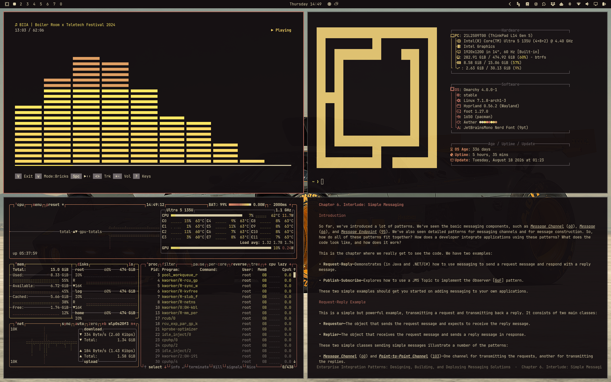
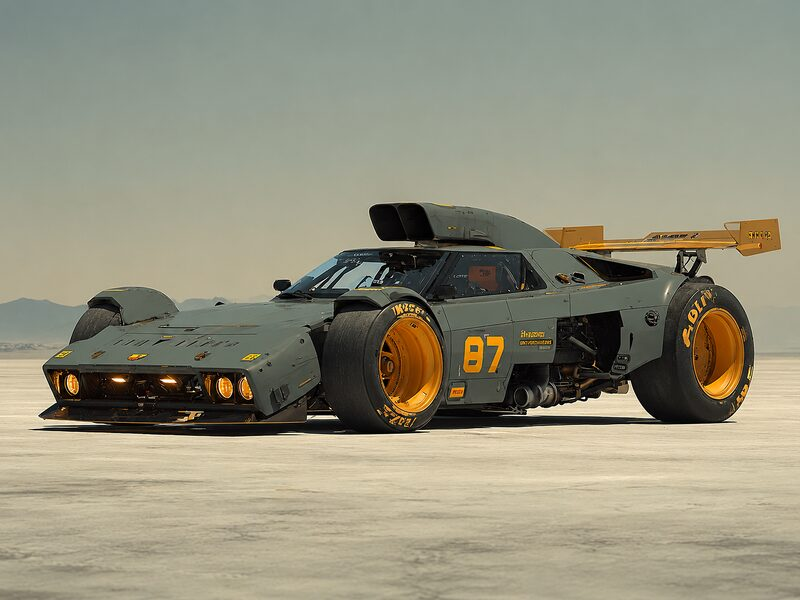
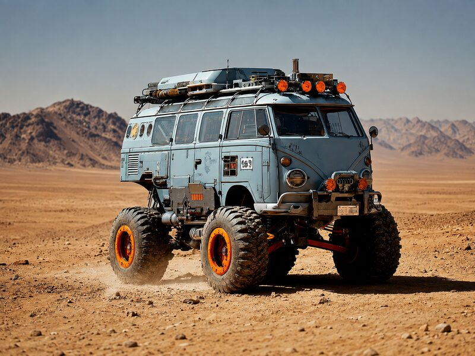
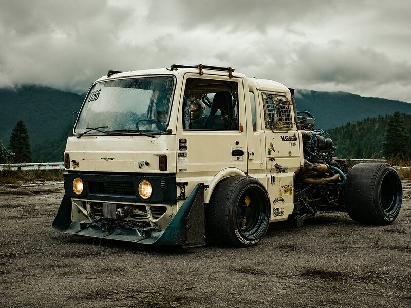

# omarchy-machineviolence-theme



An Omarchy theme built from the Machine Violence wallpaper: near-black with a red-violet cast as background, sand cream as foreground, with accents in amber, gold and copper.

Named after and inspired by [@machineviolence on X](https://x.com/machineviolence).

## Installation

```bash
omarchy theme install https://github.com/alexzeitler/omarchy-machineviolence-theme
```

## Screenshots

Click the thumbnail to open the wallpaper in full resolution.

### Machine Violence

[](backgrounds/machineviolence-4-3-4k.png)

Source: [@machineviolence on X](https://x.com/machineviolence/status/2088805259594358979)

### Expedition Van

[](backgrounds/expedition_van_4x3_4K.png)

Source: [@machineviolence on X](https://x.com/machineviolence/status/2088675481893691837)

### Mini Truck

[](backgrounds/mini_truck_4x3_4K.png)

Source: [@machineviolence on X](https://x.com/machineviolence/status/2088513206247436600)
