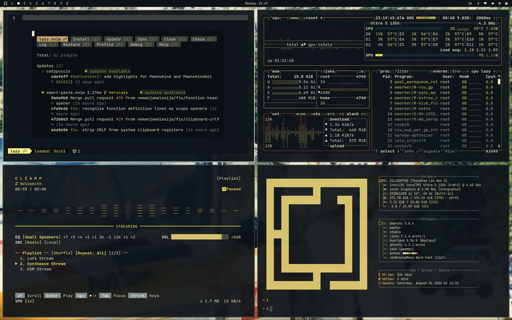
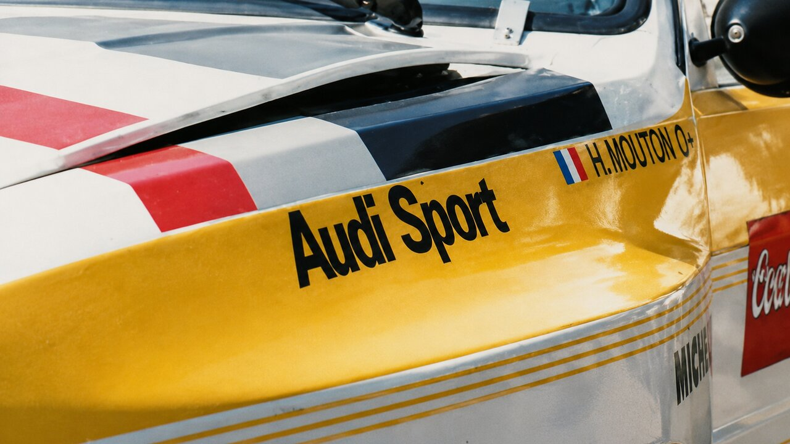
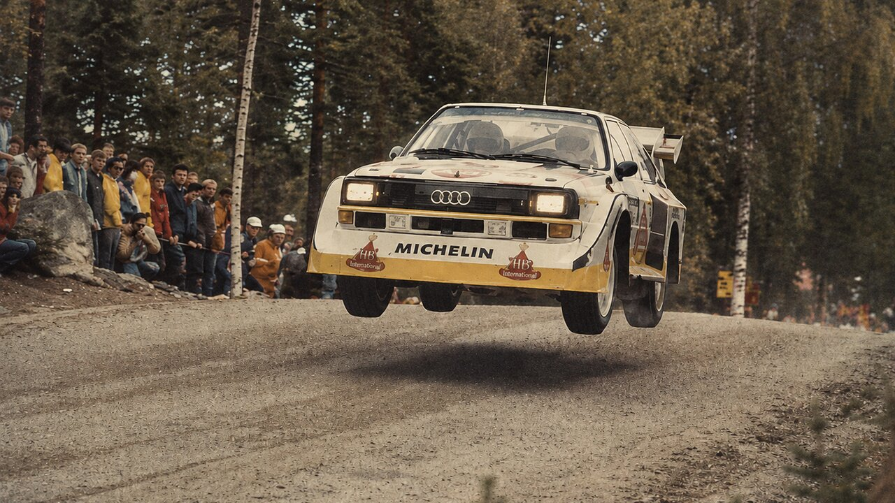
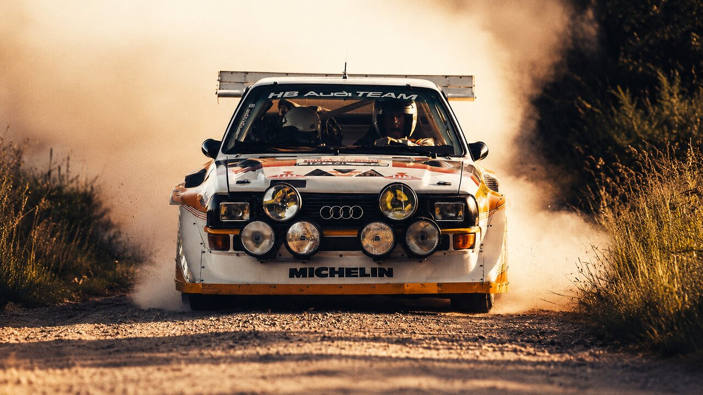
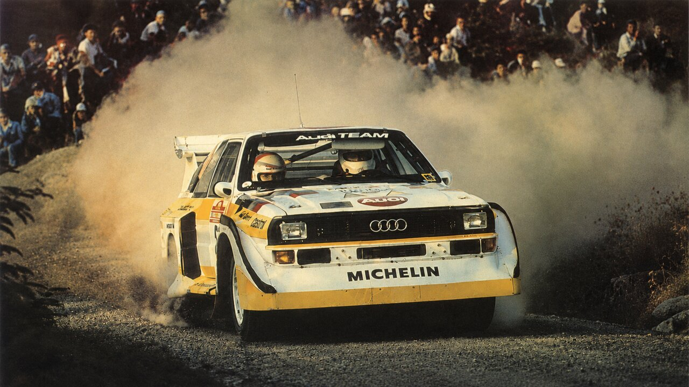

# omarchy-quattro-theme



An Omarchy theme based on the Audi Sport quattro rally livery: near-black blue-grey as background, cream as foreground, with accents in olive, brass and warm gold, red from the stripe and a white border on the active window.

A light variant is available as [omarchy-quattro-light-theme](https://github.com/AlexZeitler/omarchy-quattro-light-theme).

## Installation

```bash
omarchy theme install https://github.com/alexzeitler/omarchy-quattro-theme
```

## Screenshots

Click a thumbnail to open the wallpaper in full resolution.

### Quattro Mouton

[](backgrounds/quattro-mouton.jpg)

### Audi Sport

[](backgrounds/AUDI%20Sport.png)

### Quattro S1 Jump

[](backgrounds/Quattro%20S1%20jump.png)

### Quattro S1 Rally

[](backgrounds/Quattro%20S1%20rally.png)

### Quattro S1 Roehrl

[](backgrounds/Quattro%20S1%20Roehrl.png)
